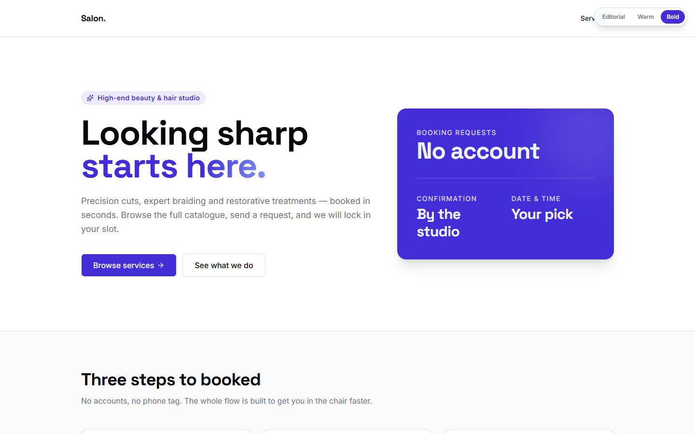
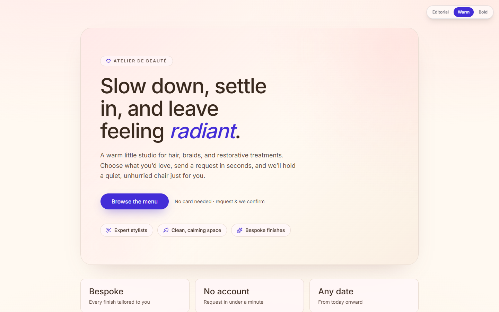
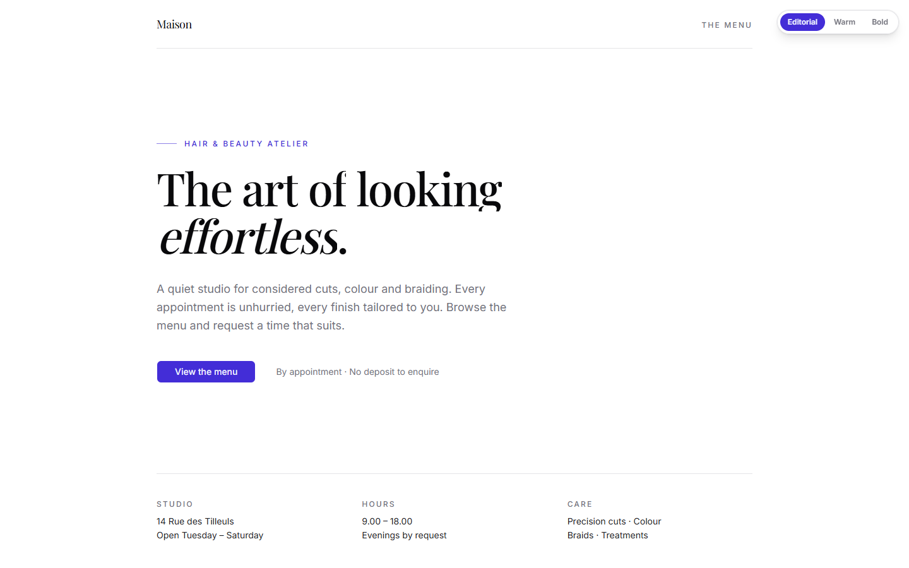

# Bookable — Multi-Style Booking Platform

**Live demo:** https://bookable.itshassan.it
**Source:** this folder, `apps/booking-service`, inside the public [laboratoire](../../README.md) monorepo.
**Write-up:** [PORTFOLIO_CASE_STUDY.md](PORTFOLIO_CASE_STUDY.md) (problem, architecture, trade-offs).

A full-stack booking platform for local service businesses (salons, studios, freelancers), built with **Next.js 16**, **Drizzle ORM** and **Neon PostgreSQL**. It pairs a database-driven public catalogue and a validated booking-request flow with an authenticated admin dashboard for managing services, pricing, images and incoming requests.

Its signature feature is a **runtime style switcher**: the same content renders in three completely distinct design systems — **Editorial**, **Warm** and **Bold** — selected live, from a single codebase.

> **Honest scope:** this is a **booking _request_ system**, not an availability/scheduling engine. Customers submit a preferred date and time; the business confirms it from the admin dashboard. There is no time-slot inventory, capacity model or double-booking prevention — see [Limitations](#limitations-read-this) and [Roadmap](#roadmap).

| Bold (default) | Warm | Editorial |
| --- | --- | --- |
|  |  |  |

---

## Try the demo

- Open https://bookable.itshassan.it and use the pill in the top-right corner to switch between **Editorial / Warm / Bold**. The choice is stored in a cookie and applied server-side, so every page comes back fully rendered in the new identity.
- Browse `/services`, open a service detail page, then `Book` to reach the request form.
- The public site runs on a real database. **Requests you submit land in the project's admin dashboard**, so please use made-up contact details.
- The admin area (`/admin`) is not open to visitors: there are no public credentials. Screenshots of the public pages are below; the admin is described in [Admin features](#admin-features).

---

## Stack

| Layer         | Technology                                                   |
| ------------- | ------------------------------------------------------------ |
| Framework     | Next.js 16 (App Router, Server Actions), React 19            |
| Database      | PostgreSQL (Neon serverless) via Drizzle ORM                 |
| Auth          | iron-session (sealed httpOnly cookie) + bcryptjs             |
| Validation    | Zod (schemas shared between client forms and server actions) |
| Forms         | react-hook-form + `@hookform/resolvers`                      |
| UI            | shadcn/ui (Radix primitives), Tailwind CSS v4, lucide-react  |
| Motion        | framer-motion (reduced-motion aware)                         |
| Notifications | sonner (toasts)                                              |
| Language      | TypeScript (strict)                                          |

---

## Core features

- **Public marketing site** with a live **3-style switcher** (Editorial / Warm / Bold) — three distinct layouts, typographies and motion treatments over one content model.
- **Service catalogue** driven by the database: pricing (range supported), duration, category, hero image and a photo gallery per service.
- **Service detail pages** with a hero image and gallery.
- **Booking request form** with client + server validation, a date picker, and clear pending / success / error states.
- **Authenticated admin dashboard**: manage services and incoming bookings.
- **Graceful demo mode**: with no database connected the app still boots, serves sample data and shows a clear demo banner (booking submissions are validated but not stored).

---

## Data flow

### Public services
```
Admin saves a service (admin form → createService / updateService server action)
  → validated (Zod) + written to Neon via Drizzle (booking_services)
  → revalidatePath("/services") + ("/admin/services")
Public reads:
  /services        → listActiveServices()      WHERE active = true ORDER BY sortOrder, title
  /services/[slug] → getActiveServiceBySlug()   WHERE slug AND active = true
  → the page picks a design variant from the bs_style cookie and renders it
Active/inactive is enforced in the public query layer only; admin sees everything.
No DATABASE_URL → the query layer returns sample data (same shape) so the UI still renders.
```

### Booking request
```
User fills the form (name*, phone | email*, preferred date*, time?, notes?)   *required
  → client validation (react-hook-form + Zod)
  → createBooking() server action → server re-validates (never trusts the client)
  → resolves the service by slug, then INSERT into booking_bookings (status = "pending")
  → if no DB: returns a demo result (validated, not stored)
Admin sees the request at /admin (newest first) and moves it through its lifecycle.
Statuses: pending → confirmed → completed → cancelled
```

### Admin auth
```
/admin/login → loginAction → Zod → bcrypt.compare vs booking_admin_users
  → seal a session ({ userId }) into an httpOnly cookie (iron-session, 7-day TTL)
Route protection (three layers, defence in depth):
  1. proxy.ts            — fast edge cookie-presence check
  2. (authed)/layout.tsx — unseals + validates the session server-side
  3. every page + action — re-checks the session before doing anything
```

---

## Admin features

- **Bookings dashboard** — summary counts (total / pending / confirmed) and a table of all requests, newest first, with the (possibly deleted) service title preserved.
- **Booking status management** — change a request's status (pending / confirmed / completed / cancelled) with optimistic UI.
- **Service management (full CRUD)**:
  - Create and edit services.
  - Edit pricing (entered in euros, stored as integer cents to avoid float drift).
  - Manage the hero image and the per-service image gallery.
  - Toggle a service active / inactive (optimistic, with revert-on-failure).
  - Delete a service (booking history is preserved via the foreign key).
- **Single-admin model**, seeded from environment variables.

---

## Security & validation notes

- **Passwords** are hashed with **bcrypt** (cost 12); the plaintext is never logged.
- **Login** returns a single generic error for every failure mode (bad input, unknown email, wrong password) and always calls `bcrypt.compare` — against the stored hash when the email exists, against a fixed placeholder hash otherwise. No claim is made about the two paths taking the same time.
- **Sessions** are sealed, **httpOnly** cookies (iron-session); `secure` in production, `SameSite=lax`. The session secret is read from `ADMIN_SESSION_SECRET` (min 32 chars) and is never hardcoded, logged or sent to the client.
- **Defence in depth** on every admin route: edge proxy + layout guard + per-action session re-check. No admin action trusts the middleware alone.
- **Validation** uses **Zod schemas shared between the client form and the server action**, so the browser and the server enforce identical rules. Server actions always re-validate before any write.
- **Database access** is **parameterised Drizzle only** — no raw SQL, no string interpolation. A unique-constraint race (slug collision) is caught and mapped to a friendly message.
- **Errors are never leaked**: raw DB/driver errors are logged server-side and a generic, safe message is returned to the client.
- **Build-safe**: the DB client never throws at module load, so `next build` succeeds even before a database is provisioned.

> **MVP-grade caveats (deliberate):** there is no rate limiting, no explicit CSRF token (relies on `SameSite=lax` + Server Actions), no account lockout and no audit log. These are the next steps before exposing the admin to untrusted traffic — see [Roadmap](#roadmap).

---

## Local setup

Requires **Node 24** and **pnpm 10**. Run from the **monorepo root**.

```bash
# 1. Install dependencies (frozen lockfile is enforced)
corepack enable && corepack prepare pnpm@10.0.0 --activate
pnpm -w install --frozen-lockfile

# 2. Configure environment (see the next section)
cp apps/booking-service/.env.example apps/booking-service/.env.local
#   then edit apps/booking-service/.env.local

# 3. Run the dev server → http://localhost:3002
pnpm dev:booking            # root alias
pnpm -F booking-service dev # same thing, package-scoped
```

The app runs **without a database** out of the box: it serves sample services and shows a demo banner. Connect a database ([Database & migrations](#database--migrations)) to make it fully live.

### Quality gates

```bash
pnpm -F booking-service lint
pnpm -F booking-service typecheck
pnpm -F booking-service test        # vitest (schemas, formatting, status transitions)
pnpm -F booking-service build       # or: pnpm build:booking
pnpm check                          # whole monorepo: lint + typecheck + test (what CI runs)
```

---

## Environment variables

Defined in `apps/booking-service/.env.local` (never committed). `.env.example` lists the same names with placeholder values.

| Variable               | Required       | Purpose                                                                              |
| ---------------------- | -------------- | ------------------------------------------------------------------------------------ |
| `DATABASE_URL`         | for live mode  | Neon Postgres pooled connection string. Empty = demo mode (sample data, no writes).  |
| `ADMIN_SESSION_SECRET` | yes (for auth) | iron-session seal key. **Must be ≥ 32 random characters.** Rotating it logs every admin out. |
| `ADMIN_EMAIL`          | yes            | Admin login email (used by the seed script and by the dev-only fallback below).       |
| `ADMIN_PASSWORD`       | yes            | Admin password (bcrypt-hashed at seed time; dev-only plaintext path below).           |

> With no `DATABASE_URL`, **in non-production only**, login authenticates against `ADMIN_EMAIL` / `ADMIN_PASSWORD` directly so the admin can be exercised before a database exists. Production always uses the bcrypt-vs-database path. `NODE_ENV` is the only other variable the app reads.

---

## Database & migrations

The schema lives in [`lib/db/schema.ts`](lib/db/schema.ts) and is managed with **Drizzle Kit**. All on-database identifiers are prefixed `booking_` so the app can share a Neon database with sibling projects without collisions.

```bash
# Generate a migration from schema changes (review the SQL in drizzle/ before applying)
pnpm -F booking-service db:generate

# Apply the versioned migrations
pnpm -F booking-service db:migrate

# Seed: admin user (bcrypt), settings singleton, demo services
pnpm -F booking-service db:seed

# Inspect with Drizzle Studio
pnpm -F booking-service db:studio
```

> ⚠️ **Use `db:migrate`, never `db:push`, on a shared database.** This app is
> designed to share a Neon database with sibling projects (hence the `booking_`
> table prefix). `db:push` reconciles the database to *this* app's schema and
> will **drop any table it doesn't know about** (e.g. another project's
> `users` / `leads`). `db:migrate` only applies the versioned migrations, which
> create the `booking_*` tables additively and touch nothing else. The `db:push`
> script still exists for a throwaway database of your own; do not run it here.

**Tables:** `booking_services`, `booking_bookings`, `booking_settings` (singleton), `booking_admin_users`. See the [data model summary in the case study](PORTFOLIO_CASE_STUDY.md#database-model).

The seed is **safe to re-run**: it looks up the admin by email and each demo service by slug, then inserts or updates (select-then-write, not a single atomic upsert).

---

## Deploy

- Own Vercel project (framework `nextjs`, Root Directory `apps/booking-service`, config in [`vercel.json`](vercel.json)). The install command runs from the monorepo root with the frozen lockfile.
- Environment variables are set in the Vercel project, never in the repo. Live at `bookable.itshassan.it` (DNS on OVH, pointed at Vercel).
- Migrations are applied manually with `db:migrate` against the target database before deploying schema changes; the deploy itself never runs them.

---

## Screenshots

Captured from the live public site (desktop 1440 px unless noted). The admin dashboard is not shown: it is behind a login and is described in [Admin features](#admin-features).

| Screenshot | File |
| ---------- | ---- |
| Landing, Bold variant (default), switcher top-right | [`docs/screenshots/01-landing-bold.png`](docs/screenshots/01-landing-bold.png) |
| Landing, Warm variant | [`docs/screenshots/02-landing-warm.png`](docs/screenshots/02-landing-warm.png) |
| Landing, Editorial variant | [`docs/screenshots/03-landing-editorial.png`](docs/screenshots/03-landing-editorial.png) |
| Public service catalogue | [`docs/screenshots/04-catalogue.png`](docs/screenshots/04-catalogue.png) |
| Service detail page with gallery | [`docs/screenshots/05-service-detail.png`](docs/screenshots/05-service-detail.png) |
| Booking request form (empty) | [`docs/screenshots/06-booking-form.png`](docs/screenshots/06-booking-form.png) |
| Admin login | [`docs/screenshots/07-admin-login.png`](docs/screenshots/07-admin-login.png) |
| Catalogue on a 390 px phone, Warm variant | [`docs/screenshots/08-catalogue-mobile.png`](docs/screenshots/08-catalogue-mobile.png) |

The three landing captures used by the portfolio card live in `apps/docs/public/image/bookable-variant-{1,2,3}.png`.

---

## Roadmap

Planned, in rough priority order:

1. **Availability / time-slot engine** — business hours, per-service slot length and double-booking prevention. _(This is the gap that turns the request system into a true scheduling engine.)_
2. **Customer accounts** — a `customers` table linked to bookings, enabling repeat-customer history.
3. **Email / SMS notifications** on new and confirmed bookings.
4. **Production hardening** — login rate limiting, explicit CSRF tokens, audit logging.
5. **Soft-delete + history** for services.
6. **Pagination & filtering** on the admin bookings table.
7. **`next/image`** with responsive `srcset` for catalogue and gallery images.

---

## Limitations (read this)

- **Not a scheduling engine.** Bookings are _requests_ with a preferred date/time; there is no slot inventory or overlap prevention.
- **Demo mode does not persist.** Without `DATABASE_URL`, booking submissions are validated but not stored (the UI says so).
- **Single admin.** No multi-user roles or permissions.
- **MVP security posture.** No rate limiting, CSRF token or audit log yet (see Roadmap).
- **No automated end-to-end tests.** The Vitest suite covers schemas, formatting and status transitions; the flows above were verified manually against the live deployment.

These are conscious trade-offs for a focused portfolio MVP, not oversights.
